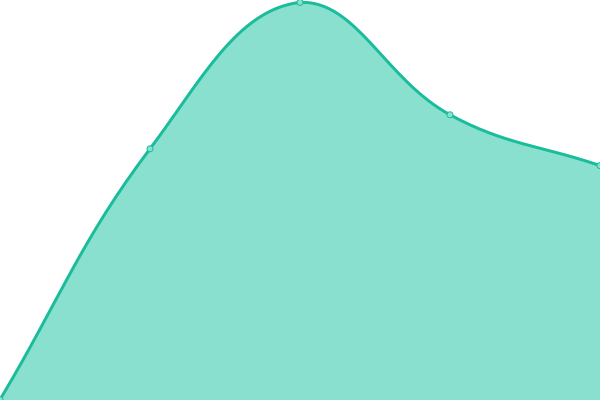

# [📈 Live Status](https://tauronik.github.io/tauro-upptime): <!--live status--> **🟧 Partial outage**

This repository contains the open-source uptime monitor and status page for [tauronik](https://tauronik.github.io/tauro-upptime), powered by [Upptime](https://github.com/upptime/upptime).

With [Upptime](https://upptime.js.org), you can get your own unlimited and free uptime monitor and status page, powered entirely by a GitHub repository. We use [Issues](https://github.com/tauronik/tauro-upptime/issues) as incident reports, [Actions](https://github.com/tauronik/tauro-upptime/actions) as uptime monitors, and [Pages](https://tauronik.github.io/tauro-upptime) for the status page.

<!--start: status pages-->
<!-- This summary is generated by Upptime (https://github.com/upptime/upptime) -->
<!-- Do not edit this manually, your changes will be overwritten -->
<!-- prettier-ignore -->
| URL | Status | History | Response Time | Uptime |
| --- | ------ | ------- | ------------- | ------ |
|  [Tauronik IT Website](https://www.tauronik.de) | 🟩 Up | [tauronik-it-website.yml](https://github.com/tauronik/tauro-upptime/commits/HEAD/history/tauronik-it-website.yml) | 

 565ms
     
 | 

<a href="https://tauronik.github.io/tauro-upptime/history/tauronik-it-website">100.00%</a>
    

|  [Firmentabata](https://firmentabata.de) | 🟩 Up | [firmentabata.yml](https://github.com/tauronik/tauro-upptime/commits/HEAD/history/firmentabata.yml) | 

 1023ms
     
 | 

<a href="https://tauronik.github.io/tauro-upptime/history/firmentabata">100.00%</a>
    

|  [Tauronik IT Support](https://support.tauronik.de) | 🟥 Down | [tauronik-it-support.yml](https://github.com/tauronik/tauro-upptime/commits/HEAD/history/tauronik-it-support.yml) | 

 0ms
     
 | 

<a href="https://tauronik.github.io/tauro-upptime/history/tauronik-it-support">23.92%</a>
    

<!--end: status pages-->

[**Visit our status website →**](https://tauronik.github.io/tauro-upptime)

## 📄 License

- Powered by: [Upptime](https://github.com/upptime/upptime)
- Code: [MIT](./LICENSE) © [tauronik](https://tauronik.github.io/tauro-upptime)
- Data in the `./history` directory: [Open Database License](https://opendatacommons.org/licenses/odbl/1-0/)
