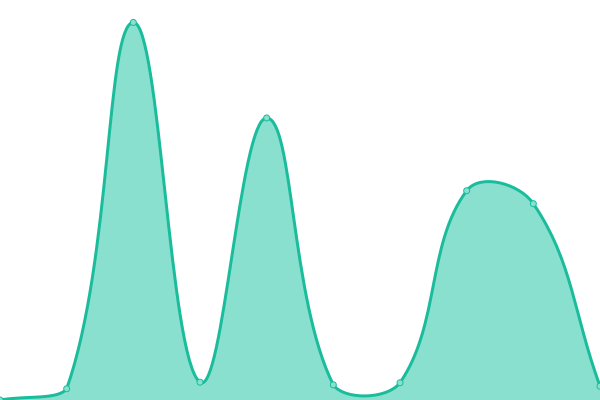
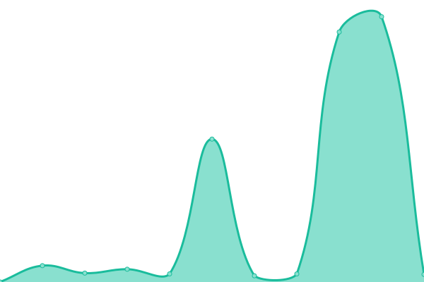

# [📈 Live Status](https://tauronik.github.io/tauro-upptime): <!--live status--> **🟧 Partial outage**

This repository contains the open-source uptime monitor and status page for [tauronik](https://tauronik.github.io/tauro-upptime), powered by [Upptime](https://github.com/upptime/upptime).

With [Upptime](https://upptime.js.org), you can get your own unlimited and free uptime monitor and status page, powered entirely by a GitHub repository. We use [Issues](https://github.com/tauronik/tauro-upptime/issues) as incident reports, [Actions](https://github.com/tauronik/tauro-upptime/actions) as uptime monitors, and [Pages](https://tauronik.github.io/tauro-upptime) for the status page.

<!--start: status pages-->
<!-- This summary is generated by Upptime (https://github.com/upptime/upptime) -->
<!-- Do not edit this manually, your changes will be overwritten -->
<!-- prettier-ignore -->
| URL | Status | History | Response Time | Uptime |
| --- | ------ | ------- | ------------- | ------ |
|  [www.tauronik.de](https://www.tauronik.de) | 🟩 Up | [www-tauronik-de.yml](https://github.com/tauronik/tauro-upptime/commits/HEAD/history/www-tauronik-de.yml) | 

 4196ms
     
 | 

<a href="https://upptime.tauronik.de/history/www-tauronik-de">100.00%</a>
    

|  [firmentabata.de](https://firmentabata.de) | 🟩 Up | [firmentabata-de.yml](https://github.com/tauronik/tauro-upptime/commits/HEAD/history/firmentabata-de.yml) | 

 972ms
     
 | 

<a href="https://upptime.tauronik.de/history/firmentabata-de">100.00%</a>
    

|  [papi.tauromax.de](https://papi.tauromax.de/monitoring) | 🟥 Down | [papi-tauromax-de.yml](https://github.com/tauronik/tauro-upptime/commits/HEAD/history/papi-tauromax-de.yml) | 

 0ms
     
 | 

<a href="https://upptime.tauronik.de/history/papi-tauromax-de">0.00%</a>
    

|  [wiki.tauronik.de](https://wiki.tauronik.de) | 🟩 Up | [wiki-tauronik-de.yml](https://github.com/tauronik/tauro-upptime/commits/HEAD/history/wiki-tauronik-de.yml) | 

 4047ms
     
 | 

<a href="https://upptime.tauronik.de/history/wiki-tauronik-de">100.00%</a>
    

|  [webmail.tauronik.de](https://webmail.tauronik.de) | 🟩 Up | [webmail-tauronik-de.yml](https://github.com/tauronik/tauro-upptime/commits/HEAD/history/webmail-tauronik-de.yml) | 

 7463ms
     
 | 

<a href="https://upptime.tauronik.de/history/webmail-tauronik-de">100.00%</a>
    

|  [Server JULIET](https://juliet.tauronik.de:5001) | 🟥 Down | [server-juliet.yml](https://github.com/tauronik/tauro-upptime/commits/HEAD/history/server-juliet.yml) | 

 1577ms
     
 | 

<a href="https://upptime.tauronik.de/history/server-juliet">9.86%</a>
    

|  [Server CHARLY](https://charlie.tauronik.de:5001) | 🟩 Up | [server-charly.yml](https://github.com/tauronik/tauro-upptime/commits/HEAD/history/server-charly.yml) | 

 1029ms
     
 | 

<a href="https://upptime.tauronik.de/history/server-charly">100.00%</a>
    

|  [Server BRAVO](https://bravo.tauronik.de:10000) | 🟩 Up | [server-bravo.yml](https://github.com/tauronik/tauro-upptime/commits/HEAD/history/server-bravo.yml) | 

 3393ms
     
 | 

<a href="https://upptime.tauronik.de/history/server-bravo">100.00%</a>
    

|  [Server TNK-VH-02](https://tnk-vh-02.tauronik.de:8006) | 🟩 Up | [server-tnk-vh-02.yml](https://github.com/tauronik/tauro-upptime/commits/HEAD/history/server-tnk-vh-02.yml) | 

 490ms
     
 | 

<a href="https://upptime.tauronik.de/history/server-tnk-vh-02">100.00%</a>
    

|  [Server TNK-VH-03](https://tnk-vh-03.tauronik.de:8006) | 🟩 Up | [server-tnk-vh-03.yml](https://github.com/tauronik/tauro-upptime/commits/HEAD/history/server-tnk-vh-03.yml) | 

 446ms
     
 | 

<a href="https://upptime.tauronik.de/history/server-tnk-vh-03">100.00%</a>
    

<!--end: status pages-->

[**Visit our status website →**](https://tauronik.github.io/tauro-upptime)

## 📄 License

- Powered by: [Upptime](https://github.com/upptime/upptime)
- Code: [MIT](./LICENSE) © [tauronik](https://tauronik.github.io/tauro-upptime)
- Data in the `./history` directory: [Open Database License](https://opendatacommons.org/licenses/odbl/1-0/)
